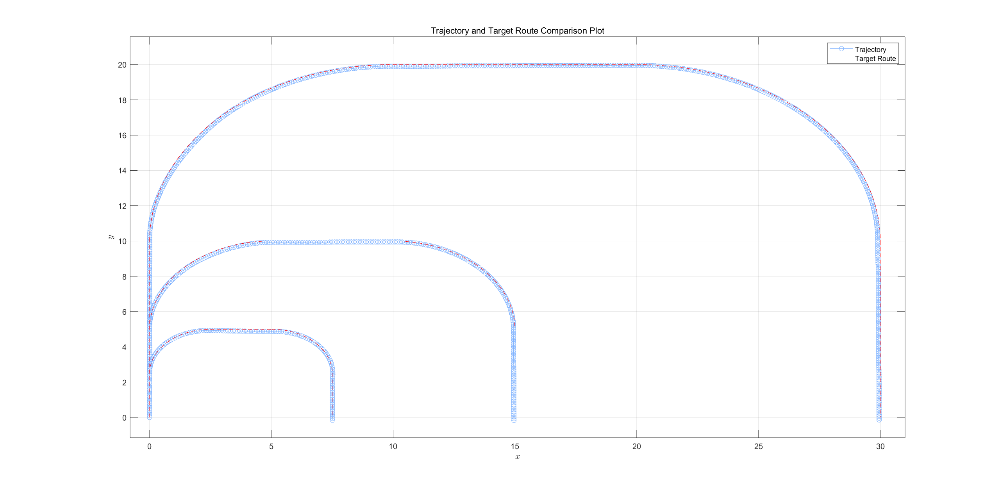
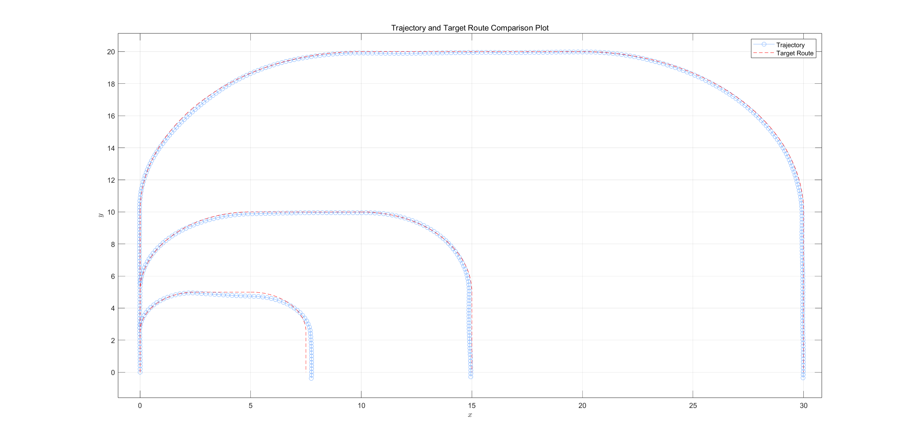
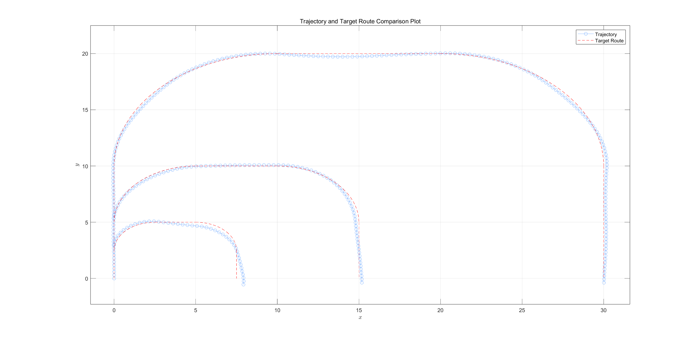
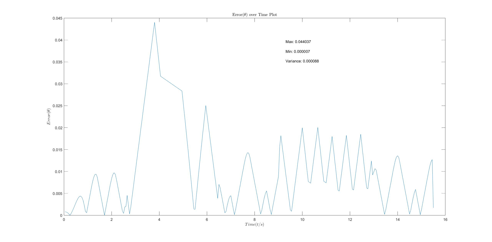

# MPC-Based Control and Obstacle Avoidance Project

## 📌 Introduction

This is an MPC (Model Predictive Control)-based control and obstacle avoidance project that utilizes the Eigen and NLopt libraries for matrix calculations and nonlinear optimization. The project includes source files, which demonstrates the application of the MPC algorithm in robot control and obstacle avoidance.

## 🖼️ Kinematic Modeling Diagram


## 🚀 Installing Dependencies and Running the Project

Before running this project, make sure to install the Eigen and NLopt libraries. Below are the installation steps and instructions on how to compile and run the project.

### Installing Eigen and NLopt Libraries and Running the Project

For Ubuntu or Debian systems:

```
sudo apt update
sudo apt install libeigen3-dev libnlopt-dev
g++ -I /usr/include/eigen3 -I /usr/include -o main main.cpp -lnlopt
./main
```

## 🎉 Results Display
Below is an image showcasing the results of running the code.

### Vehicle Control Simulation Image

The following are control simulation images for vehicle speeds:

- **1 m/s**:



- **2 m/s**:



- **3 m/s**:



The following are error over time images

|              Yaw Angle Error                                 |               Distance Error                                 |
|:------------------------------------------------------------:|:------------------------------------------------------------:|
|  |  |


### Vehicle Control and Obstacle Avoidance Simulation Image

The following are control and obstacle avoidance simulation image:


### Actual Landing Image

The actual landed historical data is stored in the root directory in a file named `historicalDataActualLanding.txt`.

  

## 📢 Acknowledgments

I would like to express my sincere gratitude to Xinke Liu for her invaluable support and contributions to this project.

## 🛡️ Cite

If you find this project useful in your research, please consider citing:

```bibtex
@misc{mpcControlPlusRoad,
  title={MPC-Based Control and Obstacle Avoidance},
  author={Fan Xie, Xinke Liu},
  howpublished = {\url{https://github.com/Xkf0/mpcControlPlusRoad}},
  year={2024}
}
```